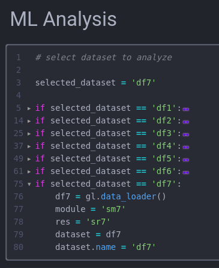
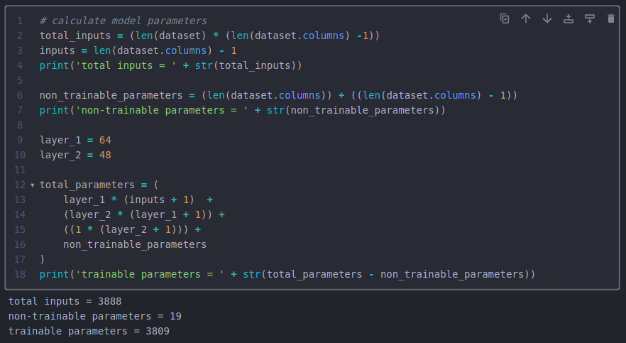
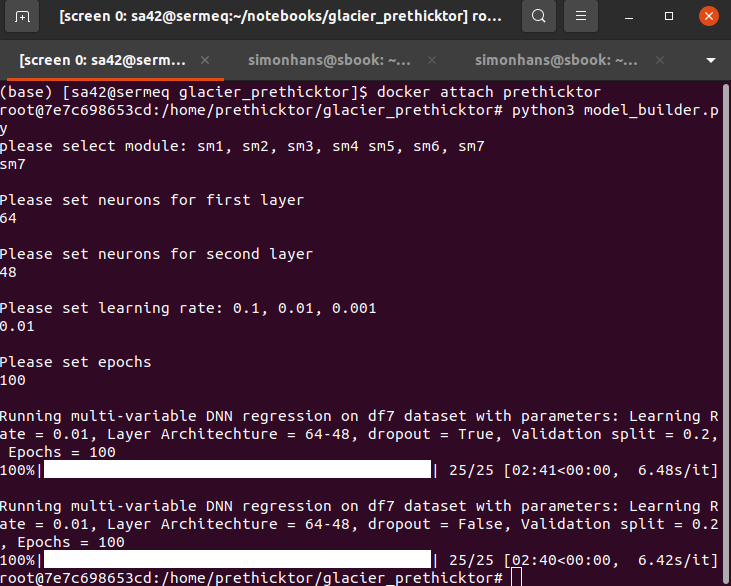
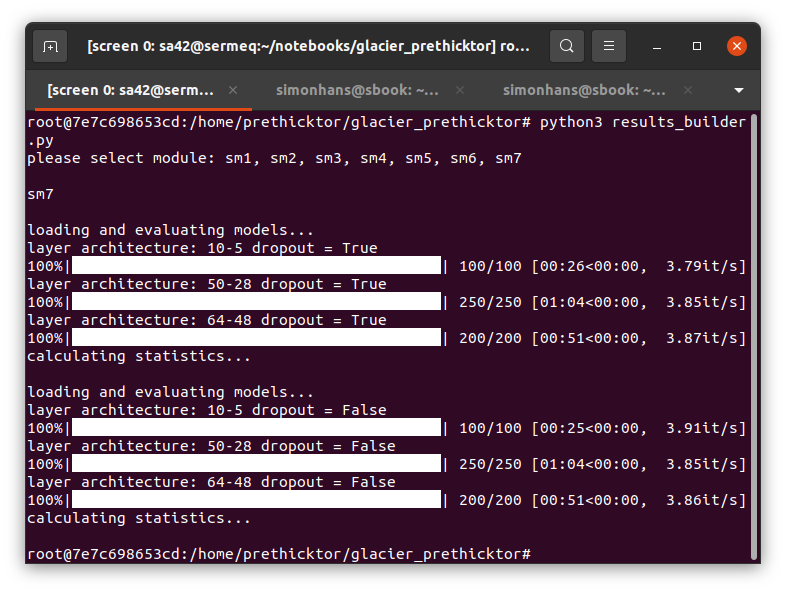
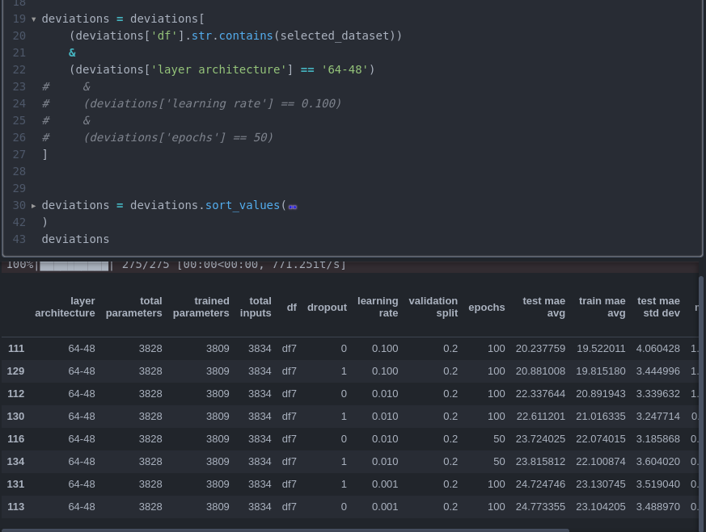
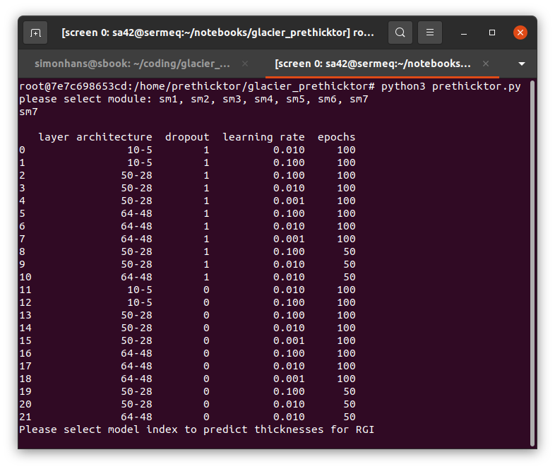
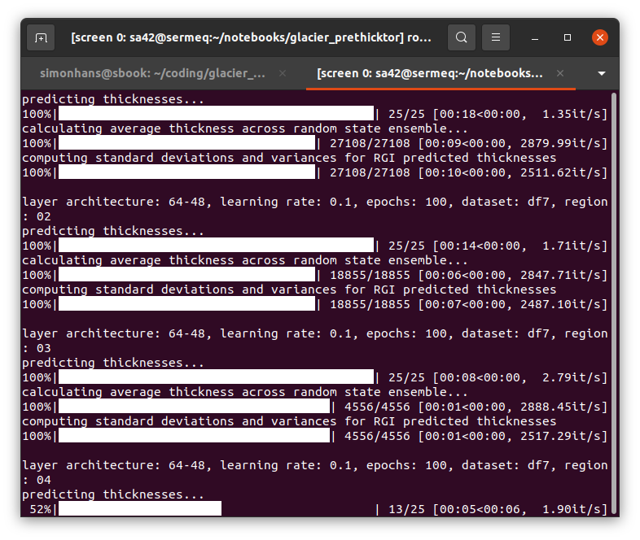

# glacier_prethicktor
A machine learning approach to predicting glacier thicknesses.

We treat estimating glacier thickness as a regression problem as opposed to ice velocity flow models. We train machine learning models with Glacier Thickness Database thickness measurements as an independent variable co-registered with surface attributes from the Randolph Glacier Inventory as dependent variables to estimate thickness.

## Workflow:

### Define Data Set Coregistration
First we must decide how to coregister GlaThiDa data with RGI information. We use the data_loader() function in glacierml.py to define our training dataset.

inputs:
root_dir = home data directory. Default = '/data/fast1/glacierml/data/',
RGI_input = 'y' - Include RGI information, 'no' - Just GlaThiDa data with no RGI info
area_scrubber = 'off', - Enables threshold for size difference between glaciers.
anomaly_input = 0.5, - Sets threshold for size difference as a percentage.
data_version = 'v1' - Which version of GlaThiDa. Most recent coregistration uses 'v2'

Each coregistration is identified as dfn, where n is the consecutive attempts at coregistration. The most recent is df8 which attained the lowest MAE with the most up to date in situ measurements.

Example of a new coregistration:

df9 = gl.data_loader(
    root_dir = '/data/fast1/glacierml/data/',
    RGI_input = 'y',
    area_scrubber = 'on',
    anomaly_input = 0.15,
    data_version = 'v2'
)

### Configure glacierml
TL;DR
<ul>
    <li> open glacierml.py and modify the first function module_selection_tool()
    <li> Copy the most recent module and modify to fit your needs.
        <li> EX: Change this
            if module == 'sm8':
                df8 = gl.data_loader(
                    root_dir = '/home/prethicktor/data/',
                    RGI_input = 'y',
                    scale = 'g',
                    area_scrubber = 'on',
                    anomaly_input = 25,
                    data_version = 'v2'
                )
                df8 = df8.drop(['RGIId', 'region', 'Centroid Distance'], axis = 1)
                df8['Zdelta'] = df8['Zmax'] - df8['Zmin']
                dataset = df8
                dataset.name = 'df8'
                res = 'sr8'
            
                To this:
            
                if module == 'sm9':
                    df9 = gl.data_loader(
                        root_dir = '/data/fast1/glacierml/data/',
                        RGI_input = 'y',
                        area_scrubber = 'on',
                        anomaly_input = 0.15,
                        data_version = 'v2'
                    )
                    df9 = df9.drop(['RGIId', 'region', 'Centroid Distance'], axis = 1)
                    df9['Zdelta'] = df9['Zmax'] - df9['Zmin']
                    dataset = df9
                    dataset.name = 'df9'
                    res = 'sr9'
            
</ul>
First we need to configure some variables with our data-set coregistration method. The first function in the main python file glacierml.py is a tool used to define the coregistration method as well as paths to save models and results, as well as details to the naming convention of the files themselves. This grew out of a tangled rats nest of code that I have yet to streamline. Anyway the function is called module_selection_tool(). This function defines a variable called 'module' which determines where the models are saved. The 'module code' which the function asks for as an input is 'sm' and the numeric for the coregistration method. For instance, the most recent module code is sm8, corresponding to df8, the training data set for coregistration method 8. The most recent module setup looks like this:

if module == 'sm8':
    df8 = gl.data_loader(
        root_dir = '/home/prethicktor/data/',
        RGI_input = 'y',
        scale = 'g',
        area_scrubber = 'on',
        anomaly_input = 25,
        data_version = 'v2'
    )
    df8 = df8.drop(['RGIId', 'region', 'Centroid Distance'], axis = 1)
    df8['Zdelta'] = df8['Zmax'] - df8['Zmin']
    dataset = df8
    dataset.name = 'df8'
    res = 'sr8'
    
This module can be copied and pasted and modified to create a new module code. Be sure to update everything to match the new coregistration method, as the names and variables are used to identify saved models. An example of a new module looks like this:

if module == 'sm9':
    df9 = gl.data_loader(
        root_dir = '/data/fast1/glacierml/data/',
        RGI_input = 'y',
        area_scrubber = 'on',
        anomaly_input = 0.15,
        data_version = 'v2'
    )
    df9 = df9.drop(['RGIId', 'region', 'Centroid Distance'], axis = 1)
    df9['Zdelta'] = df9['Zmax'] - df9['Zmin']
    dataset = df9
    dataset.name = 'df9'
    res = 'sr9'

#### 2. results_builder.py

#### 3. prethicktor.py
#### 4. aggregator.py

<!-- ### Table of Contents:

#### 1. Project Description
#### 2. Detailed description
#### 3. Workflow
#### 4. Data
#### 5. Module Details

---

## 1. Project Description

---

Knowledge of the total volume of glacier ice on Earth is an important benchmark for understanding and adapting to our changing climate. Several estimates of global glacier ice volume have recently been presented (Farinotti et al., 2019; Milan et al., 2022). These previous estimates have relied on simple, physics-based models of glacier flow. Here, we examine whether an entirely data-driven estimate of ice mass is possible.

We train a neural network on thickness measurements from the Glacier Thickness Database (GlaThiDa). We use a simple shallow/fat architecture (two dense layers and several times more neurons than input variables). Dropout layers are added to reduce the tendency to overfit the data. We treat the learning rate, number of training epochs, and the number of neurons per dense layer as tunable hyperparameters. We perform bootstrap aggregating wherein an ensemble of randomly seeded models are trained and averaged to produce one thickness estimate. We then evaluate the ensemble on the entire Randolph Glacier Inventory (RGI) with the result being a global estimate of non-ice sheet glacier volume.

The Glacier Thickness Predictor (GTP) consists of four python files, an example workflow notebook, and 5 more notebooks for model and data analysis. The example notebook provides a simplified version of the model workflow, while the main GTP is run through a terminal window and is capable of running in a docker container on either CPU or GPU. A detailed workflow is described in part 3.

---

## 2. Detailed description

---
<ol>

<li> <b> glacierml.py </b> </li>

This file contains all the functions used throughout the GTP. Imported as gl.

<li> <b> model_builder.py </b></li>

This file contains scripts to build and train ML models to predict the thickness of glaciers. When run the user will be prompted to select a module. These modules represent different ways of assembling training data with gl.data_loader() and are detailed later in part 5.

After a training module is selected, the user is then prompted for layer architecture, learning rate, and epochs. These hyperparameters are useful knobs to tweak to improve model performance, but as a first run on a module, the defaults used in this project are:

<ul>
<li> layer 1 = 10 </li>
<li> layer 2 = 5 </li>
<li> learning rate = 0.01 </li>
<li> epochs = 100 </li>
</ul>

 

With the hyperparameters input, the model_builder.py will build and train two ensembles of models. The first ensemble includes a dropout layer and the second ensemble does not include a dropout layer. The models and their histories are then saved in their respective saved folders in the projects home directory. The models and histories can also be saved into memory as a variable, demonstrated in the example-workflow notebook.

<li> <b> results_builder.py </b> </li>

The results_builder.py file loads and evaluates the models in a given training module and then saves the results to a csv. The CLI in the terminal will prompt for a module when run.

results_builder.py will load and evaluate all models in a selected module using gl.predictions_maker(). This function assembles a dataframe of model parameters and predictions made on training and testing datasets, identifiable by the given random state of selected data. Each thickness is then multiplied by the area used in its prediction to compute a predicted volume. Volumes are then summed and divided by the summed area of the dataset to produce an average thickness across all predicted glaciers in a given train or test dataset. This process is repeated for all 25 random states in the ensemble. After all models have been evaluated, results_builder.py will save a .csv file of all model predictions.

These predictions tables are then passed to the gl.deviations_calculator() function to compute the standard deviations and variances across the ensembles. This function will collapse each 25 entry predictions table into a single row for a deviations table showing the average value and standard deviations for both model mean absolute error and predicted thicknesses. These deviations tables are then loaded in the ML analysis notebook to examine predictions and loss curves, as well read by prethicktor.py to make global or regional predictions for glaciers in the Randolph Glacier Inventory.

<li> <b> prethicktor.py </b> </li>

This python file loads a desired model ensemble to make predictions for glaciers with unknown thicknesses in the Randolph Glacier Inventory (RGI).

When run, prethicktor.py first prompts for a training module selection. Then a table will be displayed to allow the user to select a model ensemble from a combination of layer architecture, dropout selection, learning rate, and epochs. The selected ensemble will load 25 models which predict 25 unique thickness, which are then averaged providing a mean thickness and variance. These mean thicknesses and variances are saved, alongside the feature data used to make predictions, as a .csv file in the 'zults/' project folder.

<li> <b> example_workflow.ipynb </b> </li>

example_workflow.ipynb provides a simplified version of the GTP workflow. It is designed as a tutorial for the project and will complete a full workflow of a single model, not an ensemble. Models and results are saved in a module not accesseble to the following python files: model_builder.py, results_builder.py, and prethicktor.py.

<li> <b> ml_analysis.ipynb </b> </li>

ml_analysis.ipynb is used to analyze performance of GTP models. The first two cells allow for module selection and model parameter calculation. These calculated parameters form the layer architecture used to tune model performance.

Next, the notebook contains cells to load a 'deviations' table. This table contains model ensemble information such as inputs, parameters, layer architecture, learning rate, and epochs, as well as statistics from model performance such as test and train MAE and predicted thickness averages and standard deviations. One of these ensembles is chosen in the next cells to evaluate the model ensemble. A cross-plot is generated of predictions made on the training and test data set combined, as well as a cross-plot of the ensemble loss curves.

<li> <b> vol_comp.ipynb </b> </li>

vol_comp.ipynb is a notebook used to generate plots comparing GTP predicted thicknesses to reference thicknesses published in <a href = 'https://rdcu.be/cT84m'> Farinotti et. al 2019  A consensus estimate for the ice thickness distribution of all glaciers on Earth </a>.

<li> <b> clusters.ipynb </b> </li>

clusters.ipynb is used for cluster analysis on different RGI statistics. Statstics analyzed include RGI mean, median, std deviation, and iqr for Area, Aspect, Lmax, Slope, Zmin, and Zmax. Clustering analyses are done both regionally and globally.

The beginning cells import dependencies and set up a regional and global dataframe of RGI feature statistics and thickness estimates of a particular model ensemble.
</ol>

---

## 3. Workflow

---

### Step 1:
Assemble or select a module of training data \

### Step 2:
Calculate layer architecture using zults grabber notebook. \

### Step 3:
Run python file model_builder.py for desired module. The CLI will ask for layer architecture, learning rate, and epochs. \

### Step 4:
Run python file results_builder.py for desired module. \

### Step 5:
Analyze ML results in zults grabber notebook and change parameters as needed. The notebook will load all models that have results, and it is possible to select which data to view. \

### Step 6:
Run python file prethicktor.py on selected module. A table of trained models will load, select one to use for making thickness predictions. \

Once selected, the GTP will predict thicknesses and calcuate deviations across the 25 models for each region \

### Step 7:
Load predicted thicknesses for desired model in zults grabber notebook and analyze results

---

## 4. Data

---

---

## 5. Module Details

---

### sm1

GlaThiDa thicknesses with GlaThiDa features only (Area, Mean Slope, Centroid Latitude, Centroid Longitude)

total inputs: 440

<table border="1" class="dataframe">   <thead>     <tr style="text-align: right;">       <th>total parameters</th>       <th>layer architecture</th>       <th>dropout</th>       <th>learning rate</th>       <th>epochs</th>       <th>test mae avg</th>       <th>test mae std dev</th>       <th>train mae avg</th>       <th>train mae std dev</th>       <th>test predicted thickness std dev</th>       <th>train predicted thickness std dev</th>     </tr>   </thead>   <tbody>     <tr>       <td>120</td>       <td>10-5</td>       <td>1</td>       <td>0.001</td>       <td>100</td>       <td>43.982542</td>       <td>8.324067</td>       <td>43.192956</td>       <td>3.202114</td>       <td>8.125887</td>       <td>5.332925</td>     </tr>     <tr>       <td>120</td>       <td>10-5</td>       <td>0</td>       <td>0.001</td>       <td>100</td>       <td>43.886775</td>       <td>6.702378</td>       <td>42.294011</td>       <td>3.664026</td>       <td>11.432916</td>       <td>4.635919</td>     </tr>     <tr>       <td>120</td>       <td>10-5</td>       <td>1</td>       <td>0.010</td>       <td>100</td>       <td>34.512794</td>       <td>31.784834</td>       <td>25.319858</td>       <td>8.377193</td>       <td>35.399437</td>       <td>8.887408</td>     </tr>     <tr>       <td>120</td>       <td>10-5</td>       <td>0</td>       <td>0.010</td>       <td>100</td>       <td>35.410193</td>       <td>33.279308</td>       <td>27.358539</td>       <td>9.137655</td>       <td>38.411076</td>       <td>13.995780</td>     </tr>     <tr>       <td>120</td>       <td>10-5</td>       <td>1</td>       <td>0.100</td>       <td>20</td>       <td>37.051389</td>       <td>36.383543</td>       <td>26.863251</td>       <td>10.033726</td>       <td>40.326183</td>       <td>9.538351</td>     </tr>     <tr>       <td>120</td>       <td>10-5</td>       <td>0</td>       <td>0.100</td>       <td>20</td>       <td>36.325935</td>       <td>32.092202</td>       <td>28.168482</td>       <td>10.867086</td>       <td>37.091282</td>       <td>15.453239</td>     </tr>     <tr>       <td>120</td>       <td>10-5</td>       <td>1</td>       <td>0.100</td>       <td>100</td>       <td>29.990507</td>       <td>31.681878</td>       <td>21.701401</td>       <td>10.107029</td>       <td>33.921673</td>       <td>11.030806</td>     </tr>     <tr>       <td>120</td>       <td>10-5</td>       <td>0</td>       <td>0.100</td>       <td>100</td>       <td>25.014423</td>       <td>21.109099</td>       <td>22.384808</td>       <td>9.479877</td>       <td>25.138636</td>       <td>10.347148</td>     </tr>     <tr>       <td>234</td>       <td>16-8</td>       <td>1</td>       <td>0.001</td>       <td>100</td>       <td>44.294147</td>       <td>16.556572</td>       <td>37.732886</td>       <td>4.862153</td>       <td>21.670259</td>       <td>6.219899</td>     </tr>     <tr>       <td>234</td>       <td>16-8</td>       <td>0</td>       <td>0.001</td>       <td>100</td>       <td>40.212565</td>       <td>14.792536</td>       <td>38.082218</td>       <td>3.912605</td>       <td>16.725891</td>       <td>11.207680</td>     </tr>     <tr>       <td>234</td>       <td>16-8</td>       <td>1</td>       <td>0.010</td>       <td>100</td>       <td>35.473023</td>       <td>33.264614</td>       <td>25.631827</td>       <td>8.643635</td>       <td>36.495533</td>       <td>9.020482</td>     </tr>     <tr>       <td>234</td>       <td>16-8</td>       <td>0</td>       <td>0.010</td>       <td>100</td>       <td>36.223756</td>       <td>35.288045</td>       <td>24.994427</td>       <td>7.885882</td>       <td>37.873325</td>       <td>8.676159</td>     </tr>     <tr>       <td>234</td>       <td>16-8</td>       <td>1</td>       <td>0.100</td>       <td>20</td>       <td>36.632644</td>       <td>33.456412</td>       <td>24.779492</td>       <td>8.016781</td>       <td>36.403217</td>       <td>9.955236</td>     </tr>     <tr>       <td>234</td>       <td>16-8</td>       <td>0</td>       <td>0.100</td>       <td>20</td>       <td>36.279050</td>       <td>34.381332</td>       <td>25.662581</td>       <td>8.617289</td>       <td>38.382145</td>       <td>10.407371</td>     </tr>     <tr>       <td>234</td>       <td>16-8</td>       <td>1</td>       <td>0.100</td>       <td>100</td>       <td>28.819094</td>       <td>26.996813</td>       <td>20.531305</td>       <td>7.521484</td>       <td>30.313887</td>       <td>8.598150</td>     </tr>     <tr>       <td>234</td>       <td>16-8</td>       <td>0</td>       <td>0.100</td>       <td>100</td>       <td>27.083550</td>       <td>28.458786</td>       <td>18.226164</td>       <td>6.898514</td>       <td>30.854834</td>       <td>9.566348</td>     </tr>     <tr>       <td>442</td>       <td>24-12</td>       <td>1</td>       <td>0.001</td>       <td>100</td>       <td>39.625907</td>       <td>27.830960</td>       <td>33.123098</td>       <td>7.625892</td>       <td>32.179047</td>       <td>12.918469</td>     </tr>     <tr>       <td>442</td>       <td>24-12</td>       <td>0</td>       <td>0.001</td>       <td>100</td>       <td>40.704802</td>       <td>25.525103</td>       <td>34.207239</td>       <td>8.011473</td>       <td>32.191868</td>       <td>15.067041</td>     </tr>     <tr>       <td>442</td>       <td>24-12</td>       <td>1</td>       <td>0.010</td>       <td>100</td>       <td>35.406686</td>       <td>33.316700</td>       <td>24.686248</td>       <td>8.001929</td>       <td>36.831692</td>       <td>8.261243</td>     </tr>     <tr>       <td>442</td>       <td>24-12</td>       <td>0</td>       <td>0.010</td>       <td>100</td>       <td>36.289563</td>       <td>35.346591</td>       <td>25.194641</td>       <td>8.166766</td>       <td>37.211166</td>       <td>9.602010</td>     </tr>     <tr>       <td>442</td>       <td>24-12</td>       <td>1</td>       <td>0.100</td>       <td>20</td>       <td>39.050521</td>       <td>40.453623</td>       <td>25.223769</td>       <td>8.807891</td>       <td>44.004639</td>       <td>9.828294</td>     </tr>     <tr>       <td>442</td>       <td>24-12</td>       <td>0</td>       <td>0.100</td>       <td>20</td>       <td>37.905610</td>       <td>36.900826</td>       <td>24.602245</td>       <td>7.278377</td>       <td>39.901024</td>       <td>9.616384</td>     </tr>     <tr>       <td>442</td>       <td>24-12</td>       <td>1</td>       <td>0.100</td>       <td>100</td>       <td>19.525705</td>       <td>13.938761</td>       <td>17.964666</td>       <td>6.328218</td>       <td>16.866167</td>       <td>9.132371</td>     </tr>     <tr>       <td>442</td>       <td>24-12</td>       <td>0</td>       <td>0.100</td>       <td>100</td>       <td>19.963202</td>       <td>18.041312</td>       <td>16.243484</td>       <td>3.832730</td>       <td>22.187843</td>       <td>6.397779</td>     </tr>   </tbody> </table>

### sm2

GlaThiDa thickness data combined with RGI surface features on a global scale. No corrections for size anomalies (Area mismatch between GlaThiDa and RGI)

total inputs: 4260

<table border="1" class="dataframe">   <thead>     <tr style="text-align: right;">       <th>total parameters</th>       <th>layer architecture</th>       <th>dropout</th>       <th>learning rate</th>       <th>epochs</th>       <th>test mae avg</th>       <th>test mae std dev</th>       <th>train mae avg</th>       <th>train mae std dev</th>       <th>test predicted thickness std dev</th>       <th>train predicted thickness std dev</th>     </tr>   </thead>   <tbody>     <tr>       <td>180</td>       <td>10-5</td>       <td>1</td>       <td>0.001</td>       <td>100</td>       <td>30.436164</td>       <td>6.128200</td>       <td>29.762397</td>       <td>7.873165</td>       <td>10.927141</td>       <td>10.642333</td>     </tr>     <tr>       <td>180</td>       <td>10-5</td>       <td>0</td>       <td>0.001</td>       <td>100</td>       <td>30.000284</td>       <td>4.357814</td>       <td>29.201366</td>       <td>2.423031</td>       <td>4.597667</td>       <td>3.198521</td>     </tr>     <tr>       <td>180</td>       <td>10-5</td>       <td>1</td>       <td>0.010</td>       <td>100</td>       <td>25.735241</td>       <td>8.812404</td>       <td>23.526555</td>       <td>6.535139</td>       <td>10.130851</td>       <td>9.744634</td>     </tr>     <tr>       <td>180</td>       <td>10-5</td>       <td>0</td>       <td>0.010</td>       <td>100</td>       <td>24.236161</td>       <td>3.500441</td>       <td>22.327142</td>       <td>0.990998</td>       <td>3.684900</td>       <td>1.641474</td>     </tr>     <tr>       <td>180</td>       <td>10-5</td>       <td>1</td>       <td>0.100</td>       <td>40</td>       <td>25.263821</td>       <td>4.539865</td>       <td>23.711115</td>       <td>3.571639</td>       <td>8.079468</td>       <td>5.934418</td>     </tr>     <tr>       <td>180</td>       <td>10-5</td>       <td>0</td>       <td>0.100</td>       <td>40</td>       <td>25.219067</td>       <td>5.754177</td>       <td>23.257817</td>       <td>3.224294</td>       <td>7.761547</td>       <td>6.372289</td>     </tr>     <tr>       <td>180</td>       <td>10-5</td>       <td>1</td>       <td>0.100</td>       <td>100</td>       <td>23.147188</td>       <td>3.798227</td>       <td>22.304446</td>       <td>3.011410</td>       <td>7.303824</td>       <td>4.823187</td>     </tr>     <tr>       <td>180</td>       <td>10-5</td>       <td>0</td>       <td>0.100</td>       <td>100</td>       <td>23.293911</td>       <td>3.810492</td>       <td>21.563213</td>       <td>1.018047</td>       <td>4.945403</td>       <td>4.518109</td>     </tr>     <tr>       <td>1976</td>       <td>50-28</td>       <td>1</td>       <td>0.001</td>       <td>100</td>       <td>25.084199</td>       <td>3.549718</td>       <td>23.562477</td>       <td>0.938657</td>       <td>3.809574</td>       <td>0.826549</td>     </tr>     <tr>       <td>1976</td>       <td>50-28</td>       <td>0</td>       <td>0.001</td>       <td>100</td>       <td>25.135300</td>       <td>3.534475</td>       <td>23.561379</td>       <td>0.936959</td>       <td>3.724854</td>       <td>0.782192</td>     </tr>     <tr>       <td>1976</td>       <td>50-28</td>       <td>1</td>       <td>0.010</td>       <td>100</td>       <td>22.691317</td>       <td>3.381273</td>       <td>21.134696</td>       <td>0.840695</td>       <td>4.295444</td>       <td>2.320906</td>     </tr>     <tr>       <td>1976</td>       <td>50-28</td>       <td>0</td>       <td>0.010</td>       <td>100</td>       <td>22.954272</td>       <td>3.578684</td>       <td>21.285193</td>       <td>1.090090</td>       <td>4.969698</td>       <td>2.017772</td>     </tr>     <tr>       <td>1976</td>       <td>50-28</td>       <td>1</td>       <td>0.100</td>       <td>40</td>       <td>24.999859</td>       <td>3.532554</td>       <td>23.468242</td>       <td>1.839651</td>       <td>8.651466</td>       <td>5.877145</td>     </tr>     <tr>       <td>1976</td>       <td>50-28</td>       <td>0</td>       <td>0.100</td>       <td>40</td>       <td>25.231052</td>       <td>3.733468</td>       <td>23.347522</td>       <td>2.343626</td>       <td>8.026451</td>       <td>8.011163</td>     </tr>     <tr>       <td>1976</td>       <td>50-28</td>       <td>1</td>       <td>0.100</td>       <td>100</td>       <td>20.181267</td>       <td>2.629075</td>       <td>19.556951</td>       <td>1.643185</td>       <td>7.771707</td>       <td>5.021609</td>     </tr>     <tr>       <td>1976</td>       <td>50-28</td>       <td>0</td>       <td>0.100</td>       <td>100</td>       <td>20.093186</td>       <td>3.302355</td>       <td>19.768997</td>       <td>1.560606</td>       <td>5.636786</td>       <td>5.957288</td>     </tr>     <tr>       <td>3828</td>       <td>64-48</td>       <td>1</td>       <td>0.001</td>       <td>100</td>       <td>24.838815</td>       <td>3.534301</td>       <td>23.129307</td>       <td>0.914245</td>       <td>3.696452</td>       <td>1.033934</td>     </tr>     <tr>       <td>3828</td>       <td>64-48</td>       <td>0</td>       <td>0.001</td>       <td>100</td>       <td>24.711207</td>       <td>3.541982</td>       <td>23.131113</td>       <td>0.878684</td>       <td>3.665761</td>       <td>0.930779</td>     </tr>     <tr>       <td>3828</td>       <td>64-48</td>       <td>1</td>       <td>0.010</td>       <td>40</td>       <td>23.886249</td>       <td>3.453894</td>       <td>22.319768</td>       <td>0.946613</td>       <td>4.612526</td>       <td>1.623780</td>     </tr>     <tr>       <td>3828</td>       <td>64-48</td>       <td>0</td>       <td>0.010</td>       <td>40</td>       <td>24.116045</td>       <td>3.381417</td>       <td>22.348776</td>       <td>0.789080</td>       <td>3.728148</td>       <td>2.305784</td>     </tr>     <tr>       <td>3828</td>       <td>64-48</td>       <td>1</td>       <td>0.010</td>       <td>100</td>       <td>22.332199</td>       <td>2.926395</td>       <td>20.895848</td>       <td>1.022141</td>       <td>4.477042</td>       <td>2.612314</td>     </tr>     <tr>       <td>3828</td>       <td>64-48</td>       <td>0</td>       <td>0.010</td>       <td>100</td>       <td>22.468233</td>       <td>3.280382</td>       <td>20.920159</td>       <td>0.967346</td>       <td>4.722921</td>       <td>2.879185</td>     </tr>     <tr>       <td>3828</td>       <td>64-48</td>       <td>1</td>       <td>0.100</td>       <td>100</td>       <td>19.915981</td>       <td>3.043197</td>       <td>19.144949</td>       <td>1.166495</td>       <td>5.787775</td>       <td>5.178887</td>     </tr>     <tr>       <td>3828</td>       <td>64-48</td>       <td>0</td>       <td>0.100</td>       <td>100</td>       <td>20.304914</td>       <td>3.277770</td>       <td>19.662795</td>       <td>1.814624</td>       <td>6.533741</td>       <td>6.447490</td>     </tr>   </tbody> </table>

### sm3

GlaThiDa thickness data combined with RGI surface features on a global scale. Corrections for size anomalies include dropping glaciers with size difference greater than 1 km

total inputs: 2816

<table border="1" class="dataframe">   <thead>     <tr style="text-align: right;">       <th>total parameters</th>       <th>layer architecture</th>       <th>dropout</th>       <th>learning rate</th>       <th>epochs</th>       <th>test mae avg</th>       <th>test mae std dev</th>       <th>train mae avg</th>       <th>train mae std dev</th>       <th>test predicted thickness std dev</th>       <th>train predicted thickness std dev</th>     </tr>   </thead>   <tbody>     <tr>       <td>180</td>       <td>10-5</td>       <td>1</td>       <td>0.001</td>       <td>100</td>       <td>19.085541</td>       <td>5.182935</td>       <td>19.990497</td>       <td>5.297365</td>       <td>7.655952</td>       <td>7.602119</td>     </tr>     <tr>       <td>180</td>       <td>10-5</td>       <td>0</td>       <td>0.001</td>       <td>100</td>       <td>21.244393</td>       <td>6.267663</td>       <td>22.154190</td>       <td>5.984530</td>       <td>9.506382</td>       <td>9.194077</td>     </tr>     <tr>       <td>180</td>       <td>10-5</td>       <td>1</td>       <td>0.010</td>       <td>20</td>       <td>15.089042</td>       <td>2.416695</td>       <td>15.695375</td>       <td>1.672437</td>       <td>2.862020</td>       <td>1.802909</td>     </tr>     <tr>       <td>180</td>       <td>10-5</td>       <td>0</td>       <td>0.010</td>       <td>20</td>       <td>14.865162</td>       <td>2.736401</td>       <td>15.389077</td>       <td>1.439904</td>       <td>3.502827</td>       <td>2.691082</td>     </tr>     <tr>       <td>180</td>       <td>10-5</td>       <td>1</td>       <td>0.010</td>       <td>25</td>       <td>15.010385</td>       <td>5.964134</td>       <td>15.203079</td>       <td>5.656405</td>       <td>8.448847</td>       <td>8.135725</td>     </tr>     <tr>       <td>180</td>       <td>10-5</td>       <td>0</td>       <td>0.010</td>       <td>25</td>       <td>13.556650</td>       <td>1.735700</td>       <td>14.035592</td>       <td>0.646668</td>       <td>2.384980</td>       <td>1.418131</td>     </tr>     <tr>       <td>180</td>       <td>10-5</td>       <td>1</td>       <td>0.010</td>       <td>100</td>       <td>11.712781</td>       <td>1.316173</td>       <td>12.293043</td>       <td>0.408550</td>       <td>2.357923</td>       <td>1.138933</td>     </tr>     <tr>       <td>180</td>       <td>10-5</td>       <td>0</td>       <td>0.010</td>       <td>100</td>       <td>13.667385</td>       <td>5.992890</td>       <td>14.448836</td>       <td>7.416969</td>       <td>10.359984</td>       <td>10.340641</td>     </tr>     <tr>       <td>180</td>       <td>10-5</td>       <td>1</td>       <td>0.100</td>       <td>100</td>       <td>11.912779</td>       <td>1.698099</td>       <td>12.318379</td>       <td>0.544532</td>       <td>3.064761</td>       <td>2.483909</td>     </tr>     <tr>       <td>180</td>       <td>10-5</td>       <td>0</td>       <td>0.100</td>       <td>100</td>       <td>11.593284</td>       <td>1.298992</td>       <td>11.963056</td>       <td>0.840035</td>       <td>2.908745</td>       <td>2.305084</td>     </tr>     <tr>       <td>1170</td>       <td>37-20</td>       <td>1</td>       <td>0.001</td>       <td>60</td>       <td>14.486935</td>       <td>2.058247</td>       <td>14.970549</td>       <td>0.629343</td>       <td>2.577383</td>       <td>0.978750</td>     </tr>     <tr>       <td>1170</td>       <td>37-20</td>       <td>0</td>       <td>0.001</td>       <td>60</td>       <td>14.431887</td>       <td>1.816792</td>       <td>15.023027</td>       <td>0.717912</td>       <td>2.415269</td>       <td>0.981900</td>     </tr>     <tr>       <td>1170</td>       <td>37-20</td>       <td>1</td>       <td>0.001</td>       <td>100</td>       <td>13.078745</td>       <td>1.505500</td>       <td>13.575672</td>       <td>0.399169</td>       <td>2.453053</td>       <td>0.786433</td>     </tr>     <tr>       <td>1170</td>       <td>37-20</td>       <td>0</td>       <td>0.001</td>       <td>100</td>       <td>13.005633</td>       <td>1.480150</td>       <td>13.644275</td>       <td>0.427591</td>       <td>2.509563</td>       <td>0.831942</td>     </tr>     <tr>       <td>1170</td>       <td>37-20</td>       <td>1</td>       <td>0.010</td>       <td>100</td>       <td>11.562479</td>       <td>1.289578</td>       <td>12.092679</td>       <td>0.427889</td>       <td>2.630548</td>       <td>1.164211</td>     </tr>     <tr>       <td>1170</td>       <td>37-20</td>       <td>0</td>       <td>0.010</td>       <td>100</td>       <td>11.691616</td>       <td>1.439804</td>       <td>12.063767</td>       <td>0.490895</td>       <td>1.963677</td>       <td>1.505779</td>     </tr>     <tr>       <td>1170</td>       <td>37-20</td>       <td>1</td>       <td>0.100</td>       <td>100</td>       <td>11.710696</td>       <td>1.960853</td>       <td>11.772711</td>       <td>1.335543</td>       <td>5.253871</td>       <td>4.716699</td>     </tr>     <tr>       <td>1170</td>       <td>37-20</td>       <td>0</td>       <td>0.100</td>       <td>100</td>       <td>11.375669</td>       <td>1.305296</td>       <td>11.461467</td>       <td>1.021207</td>       <td>2.967426</td>       <td>3.297218</td>     </tr>     <tr>       <td>2318</td>       <td>59-28</td>       <td>1</td>       <td>0.001</td>       <td>50</td>       <td>14.206065</td>       <td>1.962059</td>       <td>14.665917</td>       <td>0.544388</td>       <td>2.564208</td>       <td>1.059821</td>     </tr>     <tr>       <td>2318</td>       <td>59-28</td>       <td>0</td>       <td>0.001</td>       <td>50</td>       <td>14.146044</td>       <td>1.913393</td>       <td>14.692917</td>       <td>0.493570</td>       <td>2.621405</td>       <td>1.211916</td>     </tr>     <tr>       <td>2318</td>       <td>59-28</td>       <td>1</td>       <td>0.001</td>       <td>100</td>       <td>12.755775</td>       <td>1.426745</td>       <td>13.263999</td>       <td>0.439238</td>       <td>2.485414</td>       <td>0.696124</td>     </tr>     <tr>       <td>2318</td>       <td>59-28</td>       <td>0</td>       <td>0.001</td>       <td>100</td>       <td>12.784167</td>       <td>1.426242</td>       <td>13.264526</td>       <td>0.415543</td>       <td>2.409193</td>       <td>0.738712</td>     </tr>     <tr>       <td>2318</td>       <td>59-28</td>       <td>1</td>       <td>0.010</td>       <td>100</td>       <td>11.632391</td>       <td>1.354425</td>       <td>12.086224</td>       <td>0.499431</td>       <td>2.436388</td>       <td>1.969761</td>     </tr>     <tr>       <td>2318</td>       <td>59-28</td>       <td>0</td>       <td>0.010</td>       <td>100</td>       <td>11.612423</td>       <td>1.548752</td>       <td>12.055674</td>       <td>0.494389</td>       <td>2.902999</td>       <td>1.661194</td>     </tr>     <tr>       <td>2318</td>       <td>59-28</td>       <td>1</td>       <td>0.100</td>       <td>100</td>       <td>11.755005</td>       <td>1.867218</td>       <td>11.492489</td>       <td>1.149627</td>       <td>4.130311</td>       <td>3.913480</td>     </tr>     <tr>       <td>2318</td>       <td>59-28</td>       <td>0</td>       <td>0.100</td>       <td>100</td>       <td>11.612536</td>       <td>1.353894</td>       <td>11.425219</td>       <td>1.202729</td>       <td>4.090386</td>       <td>3.700589</td>     </tr>   </tbody> </table>

### sm4

GlaThiDa thickness data combined with RGI surface features on a global scale. Corrections for size anomalies include dropping glaciers with size difference greater than 5 km

total inputs: 3685

<table border="1" class="dataframe">   <thead>     <tr style="text-align: right;">       <th>total parameters</th>       <th>layer architecture</th>       <th>dropout</th>       <th>learning rate</th>       <th>epochs</th>       <th>test mae avg</th>       <th>test mae std dev</th>       <th>train mae avg</th>       <th>train mae std dev</th>       <th>test predicted thickness std dev</th>       <th>train predicted thickness std dev</th>     </tr>   </thead>   <tbody>     <tr>       <td>180</td>       <td>10-5</td>       <td>1</td>       <td>0.001</td>       <td>100</td>       <td>17.606575</td>       <td>2.799333</td>       <td>17.608419</td>       <td>2.150920</td>       <td>4.478066</td>       <td>3.666196</td>     </tr>     <tr>       <td>180</td>       <td>10-5</td>       <td>0</td>       <td>0.001</td>       <td>100</td>       <td>18.514497</td>       <td>6.676689</td>       <td>18.664737</td>       <td>6.128700</td>       <td>8.835190</td>       <td>8.700864</td>     </tr>     <tr>       <td>180</td>       <td>10-5</td>       <td>1</td>       <td>0.010</td>       <td>20</td>       <td>14.746905</td>       <td>2.238516</td>       <td>14.973742</td>       <td>0.971554</td>       <td>1.914473</td>       <td>0.870888</td>     </tr>     <tr>       <td>180</td>       <td>10-5</td>       <td>0</td>       <td>0.010</td>       <td>20</td>       <td>14.736629</td>       <td>2.483925</td>       <td>14.916427</td>       <td>0.821759</td>       <td>2.314411</td>       <td>0.819856</td>     </tr>     <tr>       <td>180</td>       <td>10-5</td>       <td>1</td>       <td>0.010</td>       <td>100</td>       <td>13.875627</td>       <td>6.391927</td>       <td>14.134043</td>       <td>5.374991</td>       <td>7.964189</td>       <td>7.763847</td>     </tr>     <tr>       <td>180</td>       <td>10-5</td>       <td>0</td>       <td>0.010</td>       <td>100</td>       <td>12.628151</td>       <td>2.402212</td>       <td>12.996248</td>       <td>0.616793</td>       <td>1.910316</td>       <td>0.999246</td>     </tr>     <tr>       <td>180</td>       <td>10-5</td>       <td>1</td>       <td>0.100</td>       <td>100</td>       <td>13.215501</td>       <td>2.914784</td>       <td>13.693945</td>       <td>1.975513</td>       <td>3.517315</td>       <td>3.116626</td>     </tr>     <tr>       <td>180</td>       <td>10-5</td>       <td>0</td>       <td>0.100</td>       <td>100</td>       <td>12.527823</td>       <td>2.077362</td>       <td>13.067502</td>       <td>0.724130</td>       <td>3.071940</td>       <td>2.840697</td>     </tr>     <tr>       <td>1519</td>       <td>47-21</td>       <td>1</td>       <td>0.001</td>       <td>100</td>       <td>13.484853</td>       <td>2.348697</td>       <td>13.800958</td>       <td>0.599772</td>       <td>1.860627</td>       <td>0.510737</td>     </tr>     <tr>       <td>1519</td>       <td>47-21</td>       <td>0</td>       <td>0.001</td>       <td>100</td>       <td>13.489209</td>       <td>2.384136</td>       <td>13.784435</td>       <td>0.577270</td>       <td>1.864121</td>       <td>0.535074</td>     </tr>     <tr>       <td>1519</td>       <td>47-21</td>       <td>1</td>       <td>0.010</td>       <td>15</td>       <td>13.385915</td>       <td>2.288121</td>       <td>13.854682</td>       <td>0.598554</td>       <td>2.108941</td>       <td>1.200178</td>     </tr>     <tr>       <td>1519</td>       <td>47-21</td>       <td>0</td>       <td>0.010</td>       <td>15</td>       <td>13.437355</td>       <td>2.379629</td>       <td>13.842513</td>       <td>0.551716</td>       <td>1.933822</td>       <td>0.831376</td>     </tr>     <tr>       <td>1519</td>       <td>47-21</td>       <td>1</td>       <td>0.010</td>       <td>20</td>       <td>15.509024</td>       <td>0.000000</td>       <td>13.355112</td>       <td>0.000000</td>       <td>0.000000</td>       <td>0.000000</td>     </tr>     <tr>       <td>1519</td>       <td>47-21</td>       <td>0</td>       <td>0.010</td>       <td>20</td>       <td>15.126415</td>       <td>0.000000</td>       <td>13.273845</td>       <td>0.000000</td>       <td>0.000000</td>       <td>0.000000</td>     </tr>     <tr>       <td>1519</td>       <td>47-21</td>       <td>1</td>       <td>0.010</td>       <td>100</td>       <td>12.262689</td>       <td>2.078561</td>       <td>12.637153</td>       <td>0.617366</td>       <td>2.381604</td>       <td>1.296982</td>     </tr>     <tr>       <td>1519</td>       <td>47-21</td>       <td>0</td>       <td>0.010</td>       <td>100</td>       <td>12.128779</td>       <td>2.381955</td>       <td>12.639187</td>       <td>0.639022</td>       <td>2.183692</td>       <td>1.207737</td>     </tr>     <tr>       <td>1519</td>       <td>47-21</td>       <td>1</td>       <td>0.100</td>       <td>100</td>       <td>11.484595</td>       <td>1.666102</td>       <td>11.833925</td>       <td>0.795351</td>       <td>3.668378</td>       <td>3.212767</td>     </tr>     <tr>       <td>1519</td>       <td>47-21</td>       <td>0</td>       <td>0.100</td>       <td>100</td>       <td>11.229659</td>       <td>1.544364</td>       <td>11.776068</td>       <td>0.927612</td>       <td>3.952393</td>       <td>3.247196</td>     </tr>     <tr>       <td>3036</td>       <td>64-36</td>       <td>1</td>       <td>0.001</td>       <td>30</td>       <td>16.188661</td>       <td>2.296477</td>       <td>16.417011</td>       <td>0.733593</td>       <td>2.158521</td>       <td>0.787638</td>     </tr>     <tr>       <td>3036</td>       <td>64-36</td>       <td>0</td>       <td>0.001</td>       <td>30</td>       <td>16.277062</td>       <td>2.459703</td>       <td>16.423011</td>       <td>0.688327</td>       <td>2.267554</td>       <td>0.785229</td>     </tr>     <tr>       <td>3036</td>       <td>64-36</td>       <td>1</td>       <td>0.001</td>       <td>100</td>       <td>13.252747</td>       <td>2.402459</td>       <td>13.547355</td>       <td>0.646111</td>       <td>1.734105</td>       <td>0.672083</td>     </tr>     <tr>       <td>3036</td>       <td>64-36</td>       <td>0</td>       <td>0.001</td>       <td>100</td>       <td>13.271116</td>       <td>2.338173</td>       <td>13.580903</td>       <td>0.585546</td>       <td>1.878656</td>       <td>0.528776</td>     </tr>     <tr>       <td>3036</td>       <td>64-36</td>       <td>1</td>       <td>0.010</td>       <td>100</td>       <td>11.981780</td>       <td>2.197451</td>       <td>12.455971</td>       <td>0.642732</td>       <td>2.135622</td>       <td>1.606769</td>     </tr>     <tr>       <td>3036</td>       <td>64-36</td>       <td>0</td>       <td>0.010</td>       <td>100</td>       <td>12.038212</td>       <td>2.193618</td>       <td>12.492311</td>       <td>0.654092</td>       <td>2.991897</td>       <td>1.767681</td>     </tr>     <tr>       <td>3036</td>       <td>64-36</td>       <td>1</td>       <td>0.100</td>       <td>100</td>       <td>11.474553</td>       <td>1.758483</td>       <td>11.715559</td>       <td>0.883689</td>       <td>4.424909</td>       <td>3.863244</td>     </tr>     <tr>       <td>3036</td>       <td>64-36</td>       <td>0</td>       <td>0.100</td>       <td>100</td>       <td>11.737081</td>       <td>1.733673</td>       <td>11.793007</td>       <td>0.822718</td>       <td>3.075152</td>       <td>3.799300</td>     </tr>   </tbody> </table>

### sm5

GlaThiDa thickness data combined with RGI surface features on a global scale. No corrections for size anomalies (Area mismatch between GlaThiDa and RGI). Dropped data column 'Zmed' from training and predictions as it contains several erroneous data.

total inputs: 3834

<table border="1" class="dataframe">   <thead>     <tr style="text-align: right;">       <th>total parameters</th>       <th>layer architecture</th>       <th>dropout</th>       <th>learning rate</th>       <th>epochs</th>       <th>test mae avg</th>       <th>test mae std dev</th>       <th>train mae avg</th>       <th>train mae std dev</th>       <th>test predicted thickness std dev</th>       <th>train predicted thickness std dev</th>     </tr>   </thead>   <tbody>     <tr>       <td>168</td>       <td>10-5</td>       <td>1</td>       <td>0.01</td>       <td>100</td>       <td>25.459589</td>       <td>8.166231</td>       <td>23.659464</td>       <td>6.721943</td>       <td>10.302434</td>       <td>9.638844</td>     </tr>     <tr>       <td>168</td>       <td>10-5</td>       <td>0</td>       <td>0.01</td>       <td>100</td>       <td>24.183481</td>       <td>3.510502</td>       <td>22.333696</td>       <td>0.980093</td>       <td>3.933894</td>       <td>1.126259</td>     </tr>     <tr>       <td>1768</td>       <td>50-25</td>       <td>1</td>       <td>0.01</td>       <td>100</td>       <td>23.077040</td>       <td>3.203145</td>       <td>21.333269</td>       <td>1.021539</td>       <td>4.118157</td>       <td>1.759805</td>     </tr>     <tr>       <td>1768</td>       <td>50-25</td>       <td>0</td>       <td>0.01</td>       <td>100</td>       <td>22.738840</td>       <td>3.361060</td>       <td>21.493241</td>       <td>1.068965</td>       <td>4.377402</td>       <td>2.307082</td>     </tr>     <tr>       <td>3366</td>       <td>64-42</td>       <td>1</td>       <td>0.01</td>       <td>100</td>       <td>22.866305</td>       <td>3.528474</td>       <td>21.085913</td>       <td>1.040092</td>       <td>4.426829</td>       <td>2.755531</td>     </tr>     <tr>       <td>3366</td>       <td>64-42</td>       <td>0</td>       <td>0.01</td>       <td>100</td>       <td>22.772879</td>       <td>3.227800</td>       <td>21.202340</td>       <td>1.089595</td>       <td>4.678012</td>       <td>2.574209</td>     </tr>   </tbody> </table>

### sm6

GlaThiDa thickness data combined with RGI surface features on a regional scale. No correction for size anomalies. Each data set is trained and predicted for only that RGI region

total inputs:

### sm7
GlaThiDa thickness data combined with RGI surface features on a global scale. No corrections for size anomalies (Area mismatch between GlaThiDa and RGI).

**NOTE** sm7 is the same as sm2, however, at the time the prethicktor.py file was not set up to make predictions regionally. To make regional predictions, an entire new module was required. prethicktor.py has since been patched such that any module can predict regionally.

total inputs: 4260

<table border="1" class="dataframe">   <thead>     <tr style="text-align: right;">       <th>total parameters</th>       <th>layer architecture</th>       <th>dropout</th>       <th>learning rate</th>       <th>epochs</th>       <th>test mae avg</th>       <th>test mae std dev</th>       <th>train mae avg</th>       <th>train mae std dev</th>       <th>test predicted thickness std dev</th>       <th>train predicted thickness std dev</th>     </tr>   </thead>   <tbody>     <tr>       <td>180</td>       <td>10-5</td>       <td>1</td>       <td>0.001</td>       <td>100</td>       <td>29.647513</td>       <td>5.724535</td>       <td>28.616721</td>       <td>2.069665</td>       <td>4.931937</td>       <td>4.138678</td>     </tr>     <tr>       <td>180</td>       <td>10-5</td>       <td>0</td>       <td>0.001</td>       <td>100</td>       <td>30.719780</td>       <td>6.529498</td>       <td>29.889716</td>       <td>7.942136</td>       <td>11.394197</td>       <td>10.913125</td>     </tr>     <tr>       <td>180</td>       <td>10-5</td>       <td>1</td>       <td>0.010</td>       <td>100</td>       <td>23.850120</td>       <td>3.497346</td>       <td>22.291565</td>       <td>0.806518</td>       <td>4.294350</td>       <td>1.137611</td>     </tr>     <tr>       <td>180</td>       <td>10-5</td>       <td>0</td>       <td>0.010</td>       <td>100</td>       <td>25.032291</td>       <td>6.528711</td>       <td>23.662723</td>       <td>7.191763</td>       <td>10.160369</td>       <td>9.642501</td>     </tr>     <tr>       <td>180</td>       <td>10-5</td>       <td>1</td>       <td>0.100</td>       <td>100</td>       <td>23.236795</td>       <td>3.544364</td>       <td>21.930665</td>       <td>1.420382</td>       <td>6.380354</td>       <td>5.019096</td>     </tr>     <tr>       <td>180</td>       <td>10-5</td>       <td>0</td>       <td>0.100</td>       <td>100</td>       <td>23.347840</td>       <td>3.222072</td>       <td>21.566725</td>       <td>1.173026</td>       <td>5.091355</td>       <td>4.755342</td>     </tr>     <tr>       <td>1976</td>       <td>50-28</td>       <td>1</td>       <td>0.001</td>       <td>100</td>       <td>25.144323</td>       <td>3.549629</td>       <td>23.538672</td>       <td>0.915604</td>       <td>3.578048</td>       <td>1.009563</td>     </tr>     <tr>       <td>1976</td>       <td>50-28</td>       <td>0</td>       <td>0.001</td>       <td>100</td>       <td>25.110423</td>       <td>3.502184</td>       <td>23.566199</td>       <td>0.932949</td>       <td>3.401087</td>       <td>1.087125</td>     </tr>     <tr>       <td>1976</td>       <td>50-28</td>       <td>1</td>       <td>0.010</td>       <td>50</td>       <td>24.068329</td>       <td>3.448562</td>       <td>22.188080</td>       <td>0.833040</td>       <td>3.812346</td>       <td>1.939547</td>     </tr>     <tr>       <td>1976</td>       <td>50-28</td>       <td>0</td>       <td>0.010</td>       <td>50</td>       <td>24.024015</td>       <td>3.268711</td>       <td>22.356847</td>       <td>1.013194</td>       <td>4.057677</td>       <td>1.715672</td>     </tr>     <tr>       <td>1976</td>       <td>50-28</td>       <td>1</td>       <td>0.010</td>       <td>100</td>       <td>22.561178</td>       <td>3.331436</td>       <td>21.071632</td>       <td>0.922440</td>       <td>4.072864</td>       <td>2.156377</td>     </tr>     <tr>       <td>1976</td>       <td>50-28</td>       <td>0</td>       <td>0.010</td>       <td>100</td>       <td>22.925221</td>       <td>3.606206</td>       <td>21.113651</td>       <td>1.024825</td>       <td>3.937835</td>       <td>2.152602</td>     </tr>     <tr>       <td>1976</td>       <td>50-28</td>       <td>1</td>       <td>0.100</td>       <td>50</td>       <td>23.563866</td>       <td>3.102034</td>       <td>22.289110</td>       <td>1.376429</td>       <td>6.120010</td>       <td>6.682120</td>     </tr>     <tr>       <td>1976</td>       <td>50-28</td>       <td>0</td>       <td>0.100</td>       <td>50</td>       <td>23.132563</td>       <td>3.610950</td>       <td>22.146909</td>       <td>1.574109</td>       <td>7.137610</td>       <td>5.599342</td>     </tr>     <tr>       <td>1976</td>       <td>50-28</td>       <td>1</td>       <td>0.100</td>       <td>100</td>       <td>20.028465</td>       <td>3.338884</td>       <td>19.527148</td>       <td>1.291159</td>       <td>7.229381</td>       <td>5.083309</td>     </tr>     <tr>       <td>1976</td>       <td>50-28</td>       <td>0</td>       <td>0.100</td>       <td>100</td>       <td>20.696209</td>       <td>2.694641</td>       <td>20.214970</td>       <td>1.677756</td>       <td>8.642095</td>       <td>5.592713</td>     </tr>     <tr>       <td>3828</td>       <td>64-48</td>       <td>1</td>       <td>0.001</td>       <td>100</td>       <td>24.876549</td>       <td>3.406596</td>       <td>23.097362</td>       <td>0.886186</td>       <td>3.461220</td>       <td>1.008168</td>     </tr>     <tr>       <td>3828</td>       <td>64-48</td>       <td>0</td>       <td>0.001</td>       <td>100</td>       <td>24.885821</td>       <td>3.411332</td>       <td>23.137816</td>       <td>0.871044</td>       <td>3.557214</td>       <td>1.055048</td>     </tr>     <tr>       <td>3828</td>       <td>64-48</td>       <td>1</td>       <td>0.010</td>       <td>50</td>       <td>23.815812</td>       <td>3.604020</td>       <td>22.100874</td>       <td>0.908872</td>       <td>4.230496</td>       <td>2.596175</td>     </tr>     <tr>       <td>3828</td>       <td>64-48</td>       <td>0</td>       <td>0.010</td>       <td>50</td>       <td>23.724025</td>       <td>3.185868</td>       <td>22.074015</td>       <td>0.900757</td>       <td>3.557835</td>       <td>2.357717</td>     </tr>     <tr>       <td>3828</td>       <td>64-48</td>       <td>1</td>       <td>0.010</td>       <td>100</td>       <td>22.648749</td>       <td>3.469679</td>       <td>20.791936</td>       <td>0.908162</td>       <td>4.394150</td>       <td>2.198093</td>     </tr>     <tr>       <td>3828</td>       <td>64-48</td>       <td>0</td>       <td>0.010</td>       <td>100</td>       <td>22.611158</td>       <td>3.235544</td>       <td>20.974647</td>       <td>0.937583</td>       <td>4.880827</td>       <td>2.390968</td>     </tr>     <tr>       <td>3828</td>       <td>64-48</td>       <td>1</td>       <td>0.100</td>       <td>100</td>       <td>19.618951</td>       <td>3.454822</td>       <td>18.981482</td>       <td>1.395948</td>       <td>6.849141</td>       <td>4.450141</td>     </tr>     <tr>       <td>3828</td>       <td>64-48</td>       <td>0</td>       <td>0.100</td>       <td>100</td>       <td>20.059461</td>       <td>2.549977</td>       <td>19.628291</td>       <td>1.251391</td>       <td>8.163460</td>       <td>5.486979</td>     </tr>   </tbody> </table>

### sm8

GlaThiDa thickness data combined with RGI surface features on a global scale. No corrections for size anomalies. Dropped data column 'Zmed' from training and predictions as it contains several erroneous data.

total inputs: 3834

<table border="1" class="dataframe">   <thead>     <tr style="text-align: right;">       <th>total parameters</th>       <th>layer architecture</th>       <th>dropout</th>       <th>learning rate</th>       <th>epochs</th>       <th>test mae avg</th>       <th>test mae std dev</th>       <th>train mae avg</th>       <th>train mae std dev</th>       <th>test predicted thickness std dev</th>       <th>train predicted thickness std dev</th>     </tr>   </thead>   <tbody>     <tr>       <td>3410</td>       <td>60-46</td>       <td>0</td>       <td>0.01</td>       <td>100</td>       <td>22.703015</td>       <td>3.369912</td>       <td>21.109498</td>       <td>0.850142</td>       <td>4.438800</td>       <td>3.086532</td>     </tr>     <tr>       <td>3410</td>       <td>60-46</td>       <td>1</td>       <td>0.01</td>       <td>100</td>       <td>22.506482</td>       <td>3.215159</td>       <td>20.969790</td>       <td>0.944770</td>       <td>4.384205</td>       <td>2.093761</td>     </tr>   </tbody> </table>
 -->